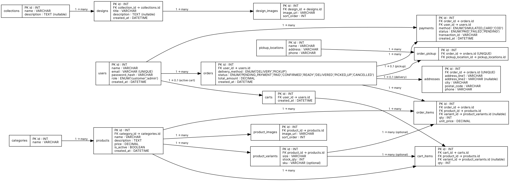

# FAVO – Overall System Flow

## 1. Customer Browses

- Showcase (designs / collections)
- Store (products)

---

## 2. Customer Adds to Cart

- Cart items are stored per authenticated user.
- Each cart item references a product and selected variant (size).

---

## 3. Customer Checkout Process

- System creates a new `order` record.
- System creates related `order_items`.
- Initial order status is set to:

```
PENDING_PAYMENT
```

---

## 4. Delivery or Pickup Selection

### Delivery Option
- Customer enters address.
- Address is saved in the `addresses` table.
- `orders.delivery_method` is set to:

```
DELIVERY
```

### Pickup Option
- Customer selects pickup location.
- Pickup choice is saved in `order_pickup`.
- `orders.delivery_method` is set to:

```
PICKUP
```

---

## 5. Payment (Simulated)

- A record is created in the `payments` table.
- Payment status is updated to:

```
PAID
```

- Order status is updated from:

```
PENDING_PAYMENT → PAID
```

---

## 6. Admin Order Processing

Admin updates order status sequentially:

```
PAID → CONFIRMED → READY → DELIVERED / PICKED_UP
```

---

# Recommended Database Tables

## 🔐 Authentication (Member 4)
- `users`
- `roles` (optional – role can be ENUM inside users table)

---

## 🎨 Showcase Module (Member 1)
- `collections`
- `designs`
- `design_images`

---

## 🛍 Store Module (Member 2)
- `categories`
- `products`
- `product_images`
- `product_variants` (size + stock stored together)

---

## 🛒 Cart & Orders (Member 3)
- `carts`
- `cart_items`
- `orders`
- `order_items`
- `order_status_history` (optional)

---

## 🚚 Delivery & Payment (Member 4)
- `addresses`
- `pickup_locations`
- `order_pickup`
- `payments`


